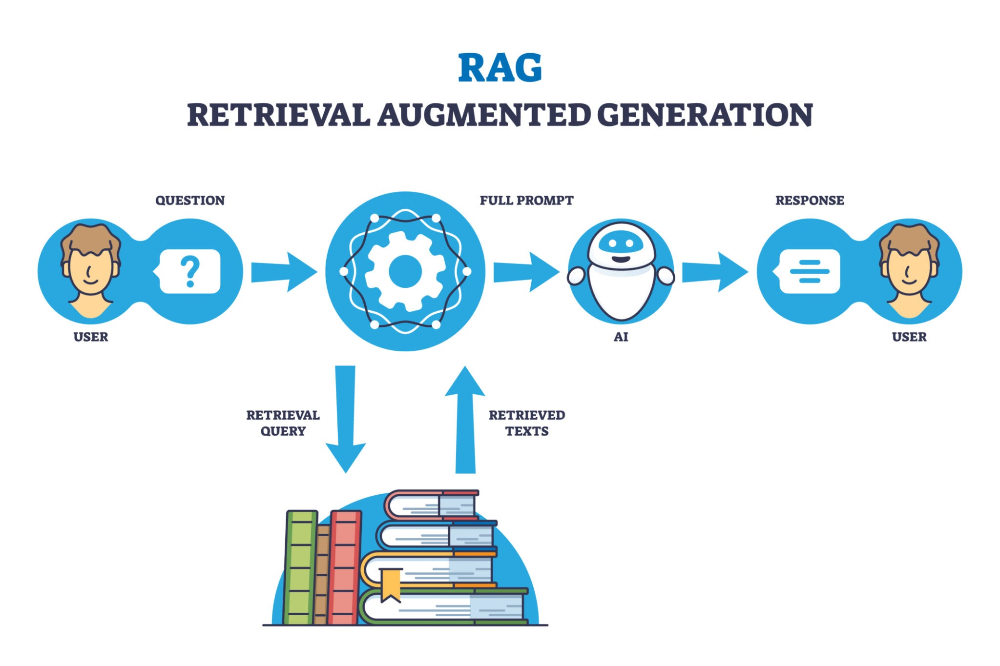

# 💄 The Cosmetic Shop AI Assistant (RAG Chatbot)

## ✨ Project Overview

This project implements a **Retrieval-Augmented Generation (RAG)** chatbot specifically designed to act as an expert beauty advisor for a cosmetic shop. Built using the **Google Gemini API** for intelligence and **FAISS** for fast, scalable data retrieval, this system allows the chatbot to provide accurate, context-aware information about products, ingredients, and usage instructions directly from a custom knowledge base (a CSV file).

This system uses a **two-stage architecture** (Ingestion and Chat) and incorporates **session memory** for continuous, natural conversations.



## 🚀 Key Technologies

  * **Brain:** **Google Gemini 2.5 Flash** (`models/gemini-2.5-flash`) for powerful natural language understanding and generation.
  * **Embeddings:** **Google Embedding Model** (`models/embedding-001`) for converting text into vectors.
  * **Vector Database:** **FAISS** (Facebook AI Similarity Search) for high-performance indexing and retrieval.
  * **Data Handling:** Python (`pandas` and `pickle`).

## 📁 Project Structure

```
Cosmetic_Shop_AI/
├── assets/
│   ├── Cosmetic_Product_Database.csv  # 👈 Your raw data
│   ├── Cosmetic_Product_Database.index # 👈 FAISS Vector Index (The Math)
│   └── Cosmetic_Product_backup pickle.pkl # 👈 Data/Text Mapping (The Content)
├── create_kb.py                     # 👈 Script to build the Vector Index
└── chatbot.py                       # 👈 Script to run the interactive chat
```

## 🛠️ Setup and Installation

### 1\. Requirements

First, install the necessary Python libraries:

```bash
pip install -q google-generativeai pandas numpy faiss-cpu
```

### 2\. API Key Configuration

You must set your Gemini API key. For this project, you can set it directly in the `chatbot.py` and `create_kb.py` files.

```python
# In both scripts, replace the placeholder:
API_KEY = "YOUR_GEMINI_API_KEY_HERE"
```

-----

## 🏗️ Step 1: Building the Knowledge Base

Before you can chat, you must convert your CSV data into vectors and save the index. This process only needs to be run once.

**Action:** Run your ingestion script (the code block provided at the end of your original input, which we'll call `create_kb.py`).

```bash
python create_kb.py
```

**Output:** This will create the two necessary files in your `assets/` folder:

  * `Cosmetic_Product_Database.index` (The FAISS index).
  * `Cosmetic_Product_backup pickle.pkl` (The Dataframe of text).

-----

## 💬 Step 2: Running the Chatbot

The `chatbot.py` script loads the saved index and starts the interactive conversation with full memory.

**Action:** Run the main chatbot application.

```bash
python chatbot.py
```

### Example Conversation Flow

| Customer (You) | AI Assistant (BOT) |
| :--- | :--- |
| `what is the best serum for dark spots` | *[Retrieves relevant serums]* |
| `how to use the ordinary serum` | *[Retrieves 'How to Use' from the correct product, utilizing the conversation history]* |
| `exit` | *[Closes the application]* |

-----

## 🧠 Architectural Deep Dive (Pro Level)

Your current system is highly optimized for performance and accuracy.

### 1\. Two-Stage Workflow

| Stage | Script | Purpose |
| :--- | :--- | :--- |
| **Offline Ingestion** | `create_kb.py` | **Performance.** Turns static CSV data into math (vectors) and saves the results (`.index`, `.pkl`). This is done once and saves API calls during runtime. |
| **Online Inference** | `chatbot.py` | **Speed.** Loads the pre-built index instantly. The RAG retrieval latency is dominated by the fast FAISS search rather than slow embedding calculation. |

### 2\. Memory Implementation

The **`self.chat_history`** list ensures continuous conversation. Every time the user sends a message, the *entire history* is injected into the final prompt sent to Gemini:

```text
--- CONVERSATION HISTORY ---
User: [Previous Question]
AI: [Previous Answer]
--- STORE INVENTORY (CONTEXT) ---
[Retrieved Product Info]
--- CURRENT INTERACTION ---
User: [New Question]
```

This prevents the AI from forgetting what product "it" refers to.

### 3\. Model Utilization

  * **Embedding Model (`models/embedding-001`):** Used only for math (converting text to vectors).
  * **Generation Model (`models/gemini-2.5-flash`):** Used only for reasoning, synthesizing, and formatting the polite final answer.

This separation of duties (one model for math, one for chat) is the correct architectural pattern for production RAG systems.

-----

### 💡 Next Steps for Improvement

  * **Query Rewriting:** To truly solve the "Retrieval Drop-off" problem, the next step would be to add a small function to use Gemini to *rewrite* follow-up queries.
      * Example: User asks "How much is it?" $\rightarrow$ Gemini rewrites it to "How much is the Alpha Arbutin Serum?" $\rightarrow$ Then, search FAISS with the rewritten query.
  * **Streamlit UI:** Wrap `chatbot.py` in a Streamlit interface for a beautiful, shareable web application.